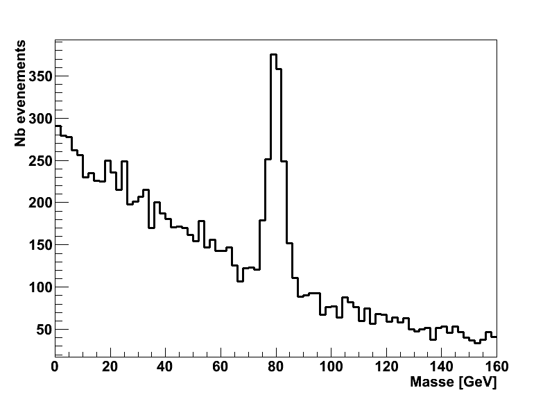

Cette partie est la troisième du texte sur la physique des particules. Après une [première partie](/content/particle_physics_and_higgs_discovery/theory.html) consacrée à la théorie et une [deuxième partie](/content/particle_physics_and_higgs_discovery/experience.html) sur les méthodes expérimentales, on s'attaque maintenant à une étude de cas concret : la découverte du boson de Higgs.

Cette partie est toujours un Work In Progress

Le boson de Higgs fait partie des particules à très courte durée de vie
qu’il nous est impossible de voir directement dans nos détecteurs parce
qu’elle se désintègrent en un temps trop court : même à des vitesses
proches de celle de la lumière, elles n’ont pas le temps d’atteindre la
première couche du détecteur. Comment faire alors pour la détecter quand
même ?

# Plan de ce chapitre

* TOC
{:toc}

# Voir une particule instable

Que devient une particule instable ? Elle se désintègre ! Elle se
désintègre en quoi ? En particules... stables ! Et voilà, on a la
solution, il suffit de détecter les particules stables issues de la
désintégration d’une particule instable et le tour est joué. Enfin il
suffit il suffit, c’est vite dit.

La suite de cette section contient un peu de maths, mais rien d'insurmontable.

Prenons une particule imaginaire, appelons la A. Cette particule a la
malchance d’être instable et de se désintégrer en deux particules
stables, que nous appellerons 1 et 2 pour conserver la généralité de ce
propos. Donc dans mon détecteur, je vais voir passer 1 et 2. Comment
savoir si elles viennent de A ou d’une autre particule ou même de deux
particules différentes ?

Et notre sauveur est : Einstein avec la relativité générale ! Qui nous
dit que, lorsque une particule A se désintègre en deux particules 1 et
2, alors on peut retrouver la masse de la particule A à partir seulement
des propriétés des particules 1 et 2 via la formule :

$$
m_{A}^{2} = 2E_{1}E_{2}\times(1-\cos{\Psi})
$$

où E1 et E2 sont les énergies des particules 1 et 2
respectivement et Psi est l’angle entre les deux particules finales.

<{:width="50%"}

Cette formule vient simplement de la conservation de l’énergie et de la
quantité de mouvement ou impulsion ($\vec{p}=m\vec{v}$).\
Pour les gens qui se souviennent encore de leurs cours sur les vecteurs,
la démonstration est relativement simple[^7] :\
En effet, en écrivant à droite les quantités dans l’état initial et à
gauche les mêmes quantités dans l’état final, on a :

$$
\left\{
 \begin{array}{ll}
        E_{A} = & E_{1}+E_{2} \\
     \vec{p_{A}} =&\vec{p_{1}}+\vec{p_{2}}
    \end{array}
    \right.
\Rightarrow
 \left\{
 \begin{array}{ll}
        E_{A}^{2} &=  (E_{1}+E_{2})^{2}= E_{1}^{2}+2 E_{1}E_{2}+ E_{2}^{2}\\
     (\vec{p_{A}})^{2} = p_{A}^{2} &=(\vec{p_{1}}+\vec{p_{2}})^{2} = p_{1}^{2} + 2\vec{p_{1}}\vec{p_{2}}+p_{2}^{2}
    \end{array}
    \right.
$$ 

Soit en soustrayant les deux lignes précédentes :

$$
E_{A}^{2}-p_{A}^{2}  = E_{1}^{2}+2 E_{1}E_{2}+ E_{2}^{2} - \left(  p_{1}^{2} +2\vec{p_{1}}\vec{p_{2}}  +p_{2}^{2}\right)
$$ 

Une des formules fondamentales de la relativité est la
fameuse 

$$
E=mc^{2}
$$ 

qui stipule que énergie et masse sont équivalentes (ie on peut passer de l'une à l'autre)
mais il existe une formule qui la
généralise pour une particule en mouvement :

$$
E^{2} = m^{2}c^{4}+p^{2}c^{2} =m^{2}+p^{2}
$$ 

dans le système d’unité spécial où c=1.

À partir de là, vous voyez qu’on peut simplifier notre équation initiale : 
$$
m_{A}^{2} =
$$

Pour chaque événement de ce type, on peut mesurer les énergies des
particules 1 et 2 ainsi que Psi et calculer le quantité

$$
2E_{1}E_{2}\times(1-\cos{\Psi}) = m_{12}^{2}
$$

que l’on appelle la *masse invariante* des particules 1 et 2. On vient de voir que cette
quantité est égale à la masse de A au carré, mais quand on fait l’expérience, on ne
trouve pas toujours exactement cette valeur, à cause des erreurs
expérimentales (on peut n’avoir mesuré par erreur et sans le savoir
qu’une partie de l’énergie des particules finales par exemple). La
distribution de masse invariante ressemblera donc à celle de la figure
suivante. 

{:width="50%"}

Je vais passer un peu de temps à vous expliquer
ce que cela représente car on se sert de ce genre de figure tout le
temps :

{:width="50%"}

En revanche, il peut arriver qu’on trouve dans notre détecteur deux
particules 1 et 2, mais qui ne viennent pas du tout de la particules A :
elles peuvent venir d’une autre particule B qui ne nous intéresse pas ou
bien de la désintégration de deux particules différentes. 

{:width="50%"}

Dans ce cas, on peut toujours trouver E1,
E2 et Psi et appliquer la formule donnant mA, ce ne sont que des maths. La différence est
qu’il n’y a là aucune raison dans ce cas pour que cette formule corresponde 
à la masse de A puisqu'il n'y a pas eu de A impliqué dans la réaction. La distribution de mA dans ce cas ne sera alors pas du tout centrée sur la valeur de mA mais pourra ressembler à ça par exemple :

{:width="50%"}

{:width="50%"}

En réalité, on va donc observer un mélange de signal (particules 1 et 2 provenant effectivement de A) et de bruit de fond (particules 1 et 2 provenant d'un autre phénomène). La distribution de mA qu'on va détecter ressemblera donc à la superposition du pic de mA "réel" et du continuum de bruit de fond :

{:width="70%"}

Tout la difficulté est de faire en sorte qu'on obtienne plus de signal que de bruit de fond, sinon le signal sera complétement "noyé" dans le bruit et on sera incapable de le distinguer. En pratique, on n'utilise pas nos seuls yeux pour déterminer si oui ou non il y a un signal, mais des méthodes d'analyses statistiques sur lesquelles nous reviendrons dans la suite de ce document.

# Modes de désintégration

# Nombre d’événements attendus

# Méthodes statistiques

# Résultat
