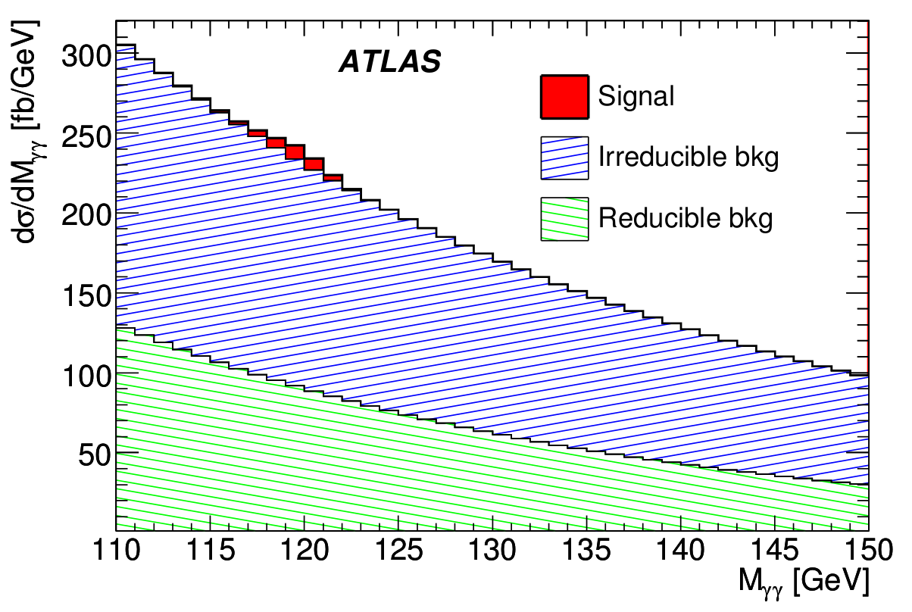
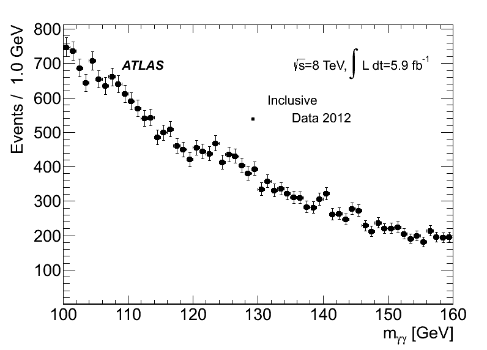
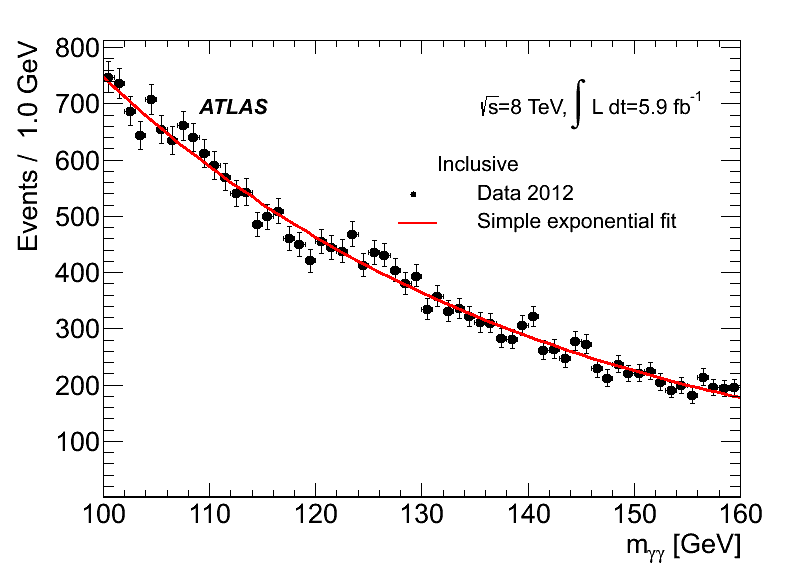
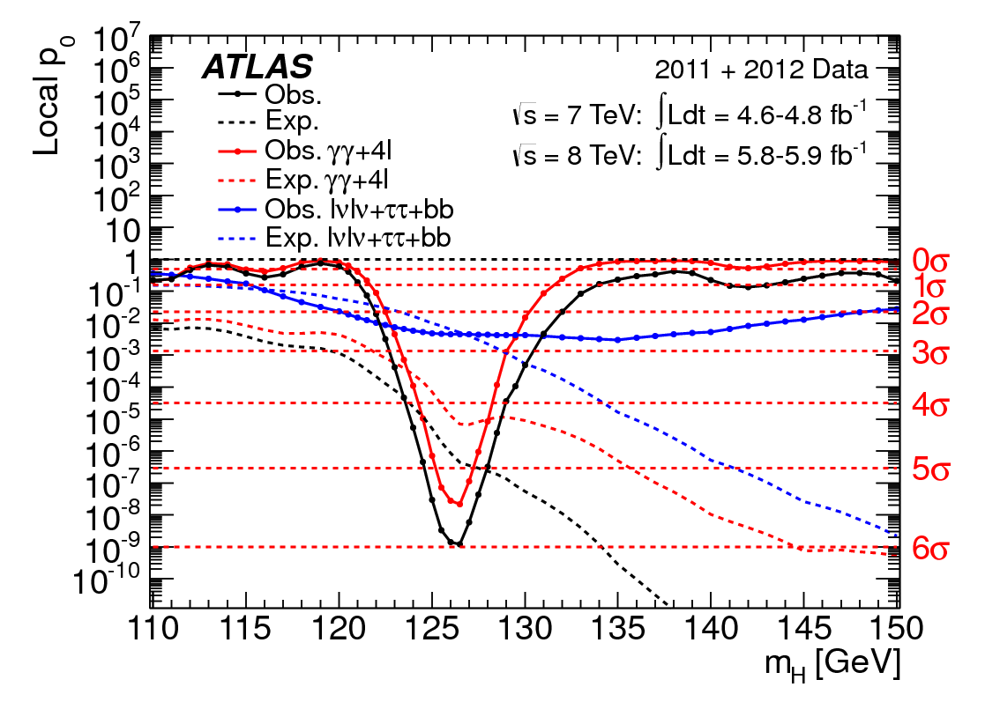

Cette partie est la troisième du texte sur la physique des particules. Après une [première partie](/content/particle_physics_and_higgs_discovery/theory.html) consacrée à la théorie et une [deuxième partie](/content/particle_physics_and_higgs_discovery/experience.html) sur les méthodes expérimentales, on s'attaque maintenant à une étude de cas concret : la découverte du boson de Higgs.

Cette partie est toujours un Work In Progress

Le boson de Higgs fait partie des particules à très courte durée de vie
qu’il nous est impossible de voir directement dans nos détecteurs parce
qu’elle se désintègrent en un temps trop court : même à des vitesses
proches de celle de la lumière, elles n’ont pas le temps d’atteindre la
première couche du détecteur. Comment faire alors pour la détecter quand
même ?

# Plan de ce chapitre

* TOC
{:toc}

# Voir une particule instable

## Le signal

Que devient une particule instable ? Elle se désintègre ! Elle se
désintègre en quoi ? En particules... stables ! Et voilà, on a la
solution, il suffit de détecter les particules stables issues de la
désintégration d’une particule instable et le tour est joué. Enfin il
suffit il suffit, c’est vite dit.

Prenons une particule imaginaire, appelons la A. Cette particule a la
malchance d’être instable et de se désintégrer en deux particules
stables, que nous appellerons 1 et 2 pour conserver la généralité de ce
propos. Ces deux particules constituent l'état final de la désintégration.
Donc dans mon détecteur, je vais voir passer 1 et 2. Comment
savoir si elles viennent de A ou d’une autre particule ou même de deux
particules différentes ?

Et notre sauveur est : Einstein avec la relativité générale ! Qui nous
dit que, lorsque une particule A se désintègre en deux particules 1 et
2, alors on peut retrouver la masse de la particule A à partir seulement
des propriétés des particules 1 et 2 via la formule :

$$
m_{A}^{2} = 2E_{1}E_{2}\times(1-\cos{\Psi})
$$

où E1 et E2 sont les énergies des particules 1 et 2
respectivement et Psi est l’angle entre les deux particules finales.

<{:width="50%"}

Vous pouvez sauter les équations si elles vous font peur, mais elles ne mordent pas.

Cette formule vient simplement de la conservation de l’énergie et de la
quantité de mouvement ou impulsion ($\vec{p}=m\vec{v}$).\
Pour les gens qui se souviennent encore de leurs cours sur les vecteurs,
la démonstration est relativement simple[^7] :\
En effet, en écrivant à droite les quantités dans l’état initial et à
gauche les mêmes quantités dans l’état final, on a :

$$
\left\{
 \begin{array}{ll}
        E_{A} = & E_{1}+E_{2} \\
     \vec{p_{A}} =&\vec{p_{1}}+\vec{p_{2}}
    \end{array}
    \right.
\Rightarrow
 \left\{
 \begin{array}{ll}
        E_{A}^{2} &=  (E_{1}+E_{2})^{2}= E_{1}^{2}+2 E_{1}E_{2}+ E_{2}^{2}\\
     (\vec{p_{A}})^{2} = p_{A}^{2} &=(\vec{p_{1}}+\vec{p_{2}})^{2} = p_{1}^{2} + 2\vec{p_{1}}\vec{p_{2}}+p_{2}^{2}
    \end{array}
    \right.
$$ 

Soit en soustrayant les deux lignes précédentes :

$$
E_{A}^{2}-p_{A}^{2}  = E_{1}^{2}+2 E_{1}E_{2}+ E_{2}^{2} - \left(  p_{1}^{2} +2\vec{p_{1}}\vec{p_{2}}  +p_{2}^{2}\right)
$$ 

Une des formules fondamentales de la relativité est la
fameuse 

$$
E=mc^{2}
$$ 

qui stipule que énergie et masse sont équivalentes (ie on peut passer de l'une à l'autre)
mais il existe une formule qui la
généralise pour une particule en mouvement :

$$
E^{2} = m^{2}c^{4}+p^{2}c^{2} =m^{2}+p^{2}
$$ 

dans le système d’unité spécial où c=1.

À partir de là, vous voyez qu’on peut simplifier notre équation initiale : 

$$
m_{A}^{2} =2E_{1}E_{2}\times(1-\cos{\Psi})
$$

Pour chaque événement où on détecte les particules 1 et 2, on peut mesurer 
les énergies mises en jeu ainsi que Psi et calculer le quantité

$$
2E_{1}E_{2}\times(1-\cos{\Psi}) = m_{12}^{2}
$$

que l’on appelle la *masse invariante* des particules 1 et 2. 

Cette quantité est aussi égale à la masse de A (au carré) lorsque 1 et 2 sont
issues de la désintégration de A.

Quand on fait l’expérience, on ne
trouve pas toujours exactement cette valeur, à cause des erreurs
expérimentales (on peut n’avoir mesuré par erreur et sans le savoir
qu’une partie de l’énergie des particules finales par exemple). La
distribution de masse invariante ressemblera donc à celle de la figure
suivante, c'est à dire une courbe en cloche (Gaussienne pour les connaisseurs)
centrée (si notre détecteur est bien réglé) sur la valeur réelle de mA,
mais avec une certaine largeur du fait des erreurs de mesrure.

{:width="50%"}

Ce type de graphique, appelé histogramme, doit s'interpréter de cette façon :

<ul>
<li>L'axe x montre la variable qui nous intéresse, ici m12</li>
<li>Cette axe est coupé en plusieurs cases </li>
<li>L'axe y est le décompte du nombre d'évenements dans chaque case. </li>
<li>Dans l'exemple précédent, on a environ 2500 collisions dans lesquelles la masse mesurée m12 est entre 75 et 80 GeV (bare gauche dans le pic)</li>
</ul>

Pour rappel, le GeV (giga-électronvolt) est une unité de masse/énergie fréquemment utilisée en physique des particules.

La forme de la distribution change si on a peu d'évenements, la distribution en cloche n'étant obtenue que lorsque le nombre de collisions est "suffisamment grand". C'est ce qu'illustre l'animation suivante, dans laquelle chaque image correspond à une augmentation du nombre de mesures.

{:width="50%"}

## Le bruit de fond

Malheureusement pour nous, un état final donné n'est pas unique, et il existe d'autres phénomènes qui peuvent produire les mêmes particules 1 et 2. Ces processus sont appelés "bruit de fond" : 

{:width="50%"}

Dans ce cas, on peut toujours trouver E1, E2 et Psi et appliquer 
la formule donnant m12, ce ne sont que des maths. En revenche, cette quantité
n'a rien à voir avec mA, puisqu'il n'y a pas de particule A impliquée dans la réaction.

La distribution de m12 dans ce cas ne sera alors pas du tout centrée sur la valeur de mA mais pourra ressembler à ça par exemple :

{:width="50%"}

De la même façon que pour le signal, la forme de la distribution dépend du nombre d'événements de bruit de fond :

{:width="50%"}

## Distribution de masse invariante réelle

En réalité, on va donc observer un mélange de signal 
(particules 1 et 2 provenant effectivement de A) et 
de bruit de fond (particules 1 et 2 provenant d'un 
autre phénomène). La distribution de m12 qu'on va 
détecter ressemblera donc à la superposition du pic 
de mA "réel" et du continuum de bruit de fond :

{:width="70%"}

Dans cette figure, le rapport signal/bruit est très favorable au signal 
et il est clair pour tout le monde qu'il y a eu des collisions avec une 
particule de masse environ 80 GeV produite. 

Dans une expérience réelle, le rapport signal/bruit est beaucoup plus faible, 
malgré tous les efforts apportés à la sélection des événements.

{:width="50%"}

Dans ces cas, l'observation de la distribution avec nos seuls yeux 
n'est pas suffisante pour conclure sur la présence d'un signal, 
mais des méthodes d'analyses statistiques existent pour répondre 
à cette question. Nous allons y revenir.

# Modes de désintégration

Bref, revenons à notre boson de Higgs. Le Higgs est une particule instable. Il se désintègre donc comme la particule fictive A de notre précédent exemple en d'autres particules. Il existe plusieurs modes de désintégration prévus par la théorie, je n'en évoquerai que deux ici : 

- La désintégration en paire de photons
- La désintégration en paire ZZ, qui eux mêmes sont aussi des particules instables et vont chacun se désintégrer en deux leptons (électrons ou muons). L'état final de cette réaction est donc constitué de 4 particules ! Mais le même type d'équation que celle vue en première partie s'applique.

# Mesure de masse invariante

ATLAS avait mesuré, dans l'état final en deux photons, la distribution de masse invariante suivante : 

{:width="70%"}

Une étude poussée du bruit de fond nous permet de déterminer le nombre d'énénements attendus, en rouge sur la figure suivante :

{:width="70%"}

Alors, signal ou pas signal ? Si oui, où ? 110, 125, 140 GeV ? 
Voyons quelles sont les méthodes statistiques qui peuvent nous venir en aide !

# Méthodes statistiques

- Ce qu’on sait :
    - On attend N événements de bruit de fond
    - On observe N’>N événements au total
- Question : est-ce que la différence est due à une fluctuation du bruit de fond parce qu'on un nombre d'observations limitées, ou à la présence d'un signal ?

Les statistiques nous permette de calculer un grandeur qu'on appelle p9 (p-value) qui représente : 

> La probabilité pour que le bruit de fond fluctue, au moins autant que ce qu’on observe.

En d'autres mots :

- Si p0 est grande : très probable que l'excès d'événement qu'on observe soit dû à une fluctuation du bruit de fond;
- Si p0 est petite : la probabilité pour que l’excès d’événements observé soit dû à une fluctuation est petite, ça doit être du signal !

Une part d’arbitraire demeure pour déterminer la valeur limite de p0 à partir de laquelle on considère qu'il y a un signal, elle est fixée à 10-7

# Statut avant le lHC

# Résultat du LHC en 2012

Voici à quoi ressemble un "plot de p0" : 

{:width="70%"}

Beaucoup d'information ici, mais concentrons nous sur l'essentiel : la courbe solide noire. Elle représente la valeur de p0 en fonction de mH. Pour rappel, plus p0 est petite, plus la probabilité d'avoir observé un réel signal est forte. On voit même sur cette figure qu'au plus bas, p0 est de l'ordre de 10-9, ce qui est inférieur à la barrière de 10-7 et c'est donc la raison pour laquelle ATLAS peut annoncer la découverte du boson de Higgs !
