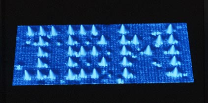

Cette partie est la deuxième partie du texte sur la physique des particules. Après une [première partie](/content/particle_physics_and_higgs_discovery/theory.html) consacrée à la théorie, on s'attaque maintenant à la partie expérimentale.

Cette partie est toujours un Work In Progress

Élaborer de belles théories est une chose, faire en sorte qu’elles
décrivent effectivement et efficacement la réalité en est une autre.
Heureusement, l’expérience est là pour servir d’arbitre et déterminer si
une théorie est compatible ou non avec ce qu’on observe de la réalité.

Pour observer une particule, deux étapes sont nécessaires :

1.  Dans un premier temps il faut identifier ou créer une source qui
    produit des particules;

2.  Ensuite il faut pouvoir la détecter, c’est-à-dire pouvoir dire, a minima, “elle
    est passée par là”.

Ces deux étapes sont réalisées par des appareils différents. Avant de
reprendre le cours de cet exposé, penchons-nous quelques instants sur
les évolutions de ces deux aspects au cours du siècle dernier, ça nous
sera utile.

# Plan de ce chapitre

* TOC
{:toc}

# Quelques exemples historiques

Cette section peut être omise en première lecture.

Ne se veut pas un historique complet mais plutôt quelques événements choisis.

Les particules ont beau être partout (ce sont les constituants de la matière), 
comment faire pour les "voir" ? Les particules sont effectivement de très petite taille, quand nos yeux ne nous permettent de voir que des objets faisant au moins quelques millimètres... On peut bien sûr penser au microscope (optique), appareil permettant de "grossir" les objets, énormément utilisé en biologie par exemple. Mais lui aussi montre ses limites autour de quelques micromètres (ordre de grandeur).

Des appareils encore plus perfectionnés permettent maintenant de visualiser les atomes comme par exemple :

{:width="70%"}

Mais cela reste toujours insuffisant pour voir des particules plusieurs ordres de grandeur plus petites !

## L'électron

Work In Progress

## Les rayons cosmiques

Les rayons cosmiques sont des flux de particules
provenant de l’espace. 

Ils ont deux inconvénihents majeurs lorsqu’on
cherche à pousser plus loin l’étude :

- Ils sont imprévisibles, on ne peut pas anticiper leur arrivée;
- On ne connaît pas l’énergie des particules incidentes.

À partir de maintenant, nous allons nous concentrer uniquement sur les
outils qui ont permis la découverte de juillet 2012, en commençant par
l’accélérateur.

# Création de particules : les accélérateurs

Les accélérateurs de particules sont basés sur un principe simple, une loi que tout le monde connaît, la fameuse 

$$E=mc^{2}$$

What? Laissez-moi vous expliquer plus en détails.

Au LHC par exemple, on prend des particules que l'on connaît et que l'on peut trouver facilement, les protons. Les protons sont des noyaux d'atomes d'hydrogène, l'atome le plus simple qui puisse exister. Ces protons sont donc regroupés puis accélérés à des vitesses proches de celle de la lumière, ce qui augmente leur énergie (l'énergie dûe au mouvement ou énergie cinétique). Lorsque ces paquets de protons circulant en sens inverse se croisent, l'énergie qu'ils transportent se retrouve "disponible" pour créer de nouvelles particules.

L'accélérateur a l'avantage de permettre un contrôle absolu sur les collisions : l'endroit où elles ont lieu et l'énergie initiale disponible. Ce que l'on ne maîtrise pas en revenche, ce sont les produits de la réaction, qui suivent des lois probabilistiques (mécanique quantique oblige).

La figure suivante illustre le complexe d'accélération du CERN (en 2012). Le plsu grand anneau en haut correspond au LHC, mais les protons sont d'abord accélérés progressivement par de plus petits anneaux, qui sont les restes d'expériences passées. 

{:width="70%"}

Sur le LHC, quatre principaux détecteurs sont installés, les collisins étant provoquées au centre de chacun d'eux : ATLAS, CMS, LHCb et ALICE.

Voyons maintenant comment ces détecteurs fonctionnent.

# Observer : les détecteurs

Avant de se demander comment construire un détecteur, on doit se poser
un minimum de questions, la première étant : qu’est-ce que je veux cherche 
à faire ou qu'est-ce que je veux mesurer ?

## Que veut-on mesurer ? 

C’est simple, on veut TOUT connaître des particules qui sont crées. Cela
se traduit par :

- On veut voir toutes les particules.
- On veut pouvoir déterminer le type de particles (est-ce un photon ? un életron ?)
- ... leur trajectoire...
- ... leur charge électrique...
- ... et leur énergie.

Le premier point est obtenu en dessinant un détecteur avec le moins de
trous possibles. La tâche n’est pas si simple qu’il n’y paraît car les
détecteurs font maintenant appel à de nombreux systèmes électroniques
qui nécessitent une alimentation électrique et une extraction du signal,
donc beaucoup beaucoup (beaucoup) de câbles et il faut de la place pour les faire
passer !

## Suivre la trajectoire

Pour suivre la trajectoire d'une particule, on utilise un trajectographe. Il s'agit d'un détecteur divisé en cellules réparties sur plusieurs couches. Au passage d'un particule, celle-ci va arracher des électrons aux atomes constituant la cellule et ainsi créer un léger courant électrique que l'on va pouvoir détecter. La cellule correspondante sera donc "allumée", en vert sur le schéma ci-dessous, et en enregistrant les cellules allumées successivement, on peut reconstruire le chemin des particules crées.

{:width="70%"}

## Mesurer l’énergie

En ce qui concerne l'énergie, c'est un peu plus compliqué. En effet, le détecteur précédant ne change pas la particule, elle ressort du trajectographe intacte. Pour mesurer son énergie en revance, on va être obligé de la détruire dans un détecteur qu'on appelle "calorimètre". C'est en quelque sorte la somme des énergies de toutes les particules produites qui nous permettra de remonter à l'information qu'on cherche.

{:width="70%"}

## Les jets

Work In Progress

## Comment combiner le tout

Un détecteur tel qu'ATLAS est formé de plusieurs couches successives : 

- Le trajectographe ou détecteur de traces
- Les calorimètres : 
    - Electromagnétique pour mesurer l'énergie des électrons et photons
	- Hadronique pour mesruer les énergies des jets
- Le détecteur de muons. Les muons sont des particules semblables à l'électron mais beaucoup plus lourdes, ce qui les rend plus difficiles à arrêter. Elles ont besoin d'un détecteur spécifique.

En fonction des sous-détecteurs dans lesquels une particule a été vue, on peut en déduire sa nature en utilisant le tableau ci-dessous :

{:width="70%"}

Les neutrinos sont des particules intéragissant très peu avec la matière environnante et sont donc invisibles pour ce type de détecteurs. On considère qu'il y a eu un neutrino produit dans la réaction lorsqu'on mesure de l'énergie manquante. C'est en partie ce qui rend les mesures d'énergie extremement importantes.
