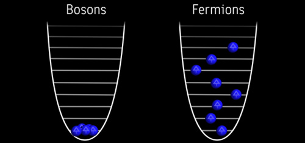

Avant de nous lancer dans l’aventure de la recherche d’une particule,
une petite introspection dans la théorie de ce domaine de la physique
est inévitable : on ne peut pas chercher efficacement une particule sans
en connaître les propriétés, comme on ne va pas chercher un livre dans
une bibliothèque sans en connaître le titre, l’auteur et/ou la couleur
de la couverture.

# La physique des particules, qu’est-ce que c’est ?

Rentrons dans le vif du sujet : un physicien des particules cherche à
comprendre de quoi est faite la matière qui nous entoure à son niveau le
plus fondamental, et comment les différents éléments qui la constituent
interagissent entre eux. La technique utilisée jusqu’à maintenant, avec
succès, a été de creuser ou plutôt de regarder de plus en plus près. De
la même manière qu’en s’approchant d’un tableau pointilliste, on en voit
les détails et on peut admirer la technique de l’artiste[^1], la matière
se révèle quand on regarde dans l’infiniment petit. Commençons donc
notre descente dans les entrailles de la matière.

# Structure de la matière

Commençons donc notre plongée au cœur de la matière. Le modèle que je
vais vous montrer est la vision actuelle de la structure de la matière,
celle-ci ayant beaucoup évoluée avec le temps. L’objectif ici est juste
de décrire le tableau, pas tous les traits de pinceaux qui ont permis de
l’obtenir.

Avant tout, un petit rappel des échelles de longueurs auxquelles on va
travailler : la figure suivante classe quelques objets que vous
reconnaîtrez sur un axe gradué en longueur.

{:width="70%"}

Notre point de départ sera l’atome, déjà plus petit que le nanomètre,
constituant électriquement neutre de
tous les matériaux de la vie courante, mais aussi du Soleil et de toutes
les autres étoiles, et même de tous les objets célestes. L’atome n’est
pas “élémentaire” dans le sens où on lui connaît une structure interne :
on peut le décomposer en un noyau, positif, autour duquel gravitent des
électrons, négatifs.

En ce qui concerne l’électron, aucune structure interne n’a été
découverte jusqu’à maintenant. Pour nous, l’électron est donc une
particule élémentaire.

{:width="70%"}

En revanche, l’histoire n’est pas la même pour le noyau atomique : il a
été montré qu’il était principalement formé de deux types d’objets : les **protons**,
de charge électrique positive, et les **neutrons**, qui, comme leur nom
l’indique, sont électriquement neutres, c’est-à-dire que leur charge
électrique est nulle. Les protons et les neutrons sont l’objet d’étude
de la physique nucléaire. La physique des particules s’occupe d’objets
encore plus petits. Parce que les protons et les neutrons ont encore une
structure interne : ils sont formés de particules qu’on appelle
“**quarks**” et qui sont considérés aujourd’hui comme élémentaires au
même titre que les électrons (mais peut-être n'avons nous juste pas encore 
inventé le bon instrument pour révéler cette composition ?).

Il existe différents types de quarks, qui peuvent se regrouper pour
former des particules plus grosses. Par exemple, le protons et le
neutrons sont formés chacun de 3 quarks : deux quarks *u* et un quark
*d* pour le proton; un quark *u* et deux quarks *d* pour le neutron.

Ces trois particules élémentaires (électron, quark *u* et quark *d*)
nous permettent de commencer à construire le Modèle Standard de la
physique des particules.

# Le Modèle Standard de la physique des particules

## La matière

À ces trois particules, il faut ajouter une quatrième : le neutrino
électronique, particule neutre et très légère, introduite de manière
théorique pour assurer la conservation de l’énergie dans certaines
réactions et découverte expérimentalement quelques années plus tard.

L'histoire des neutrinos est un bel exemple de complémentarité entre
théorie et expérience en physique. Je vous en parlerai peut-être plus tard
pour ne pas trop m'éparpiller ici.

Ces quatre particules élémentaires donc forment ce qu’on appelle la
première famille de particules élémentaires qui constitue la matière de
tous les jours. Le tableau ci-dessous présente les différentes
particules élémentaires. Les chiffres entre parenthèse sont les charges
électriques [^2]: on reconnaît le -1 pour l’électron et le 0 pour le
neutrino. Par contre les quarks ont des charges électriques assez
inhabituelles car fractionnaires.

{:width="70%"}

On peut vérifier qu’avec ces charges pour les quarks, on retrouve bien
les charges de +1 pour le proton (uud) et 0 pour le neutron (udd).

Comme vous pouvez le voir sur la figure précédente, les quatre
particules qu’on a vu forment la première famille de particules
élémentaires. Mais beaucoup d’autres ont été découvertes dans la suite,
en observant les *rayons cosmiques* par exemple, et ont pu être classées
dans deux nouvelles familles, qui contiennent des particules aux
propriétés semblables à celles de la première famille, mais plus
lourdes. Par exemple, le muon est le “cousin” de l’électron, de même
charge électrique, mais avec une masse plus élevée.

On arrive donc à un total de douze particules élémentaires. Et c’est
tout. Ou presque...

Certains d’entre vous auront probablement entendu parler
d’**anti-matière** ? Ça a l’air compliqué comme ça mais c’est en fait
extrêmement simple : pour chacune des 12 particules élémentaires
précédentes, il faut ajouter une nouvelle particule, dont la seule
différence par rapport à la particule est la charge électrique. Par
exemple on aura un anti-muon (symbole : $\bar{\mu}$ ) de charge +1, un
anti-up de ($\bar{u}$) charge -2/3, etc.

Particule et anti-particule peuvent tout à fait vire chacune de leur
côté. Elles sont cependant “liées” par les phénomnes dits de *création
de paires* et *annihilation* : plus de détails dans la section sur les
diagrammes de Feynman plus bas.

Ceci achève notre description actuelle de la matière : un total de 24
particules.

Vous pensez qu’on a fini ? Et bien non, il nous manque encore un élément
indispensable : comprendre comment toutes ces particules interagissent
entre elles ? Qu’est-ce qui les les quarks dans le noyau par exemple ?

## Les forces ou interactions

Pour répondre à cette question, on va faire la liste des interactions
entre les particules en essayant de comprendre leur rôle.

-   Une interaction que vous connaissez déjà et à laquelle je fais
    référence depuis le début de ce chapitre est l’interaction
    électrique, ou plus exactement **électromagnétique**. C’est elle qui
    agit sur les particules chargées, de sorte que... les opposés
    s’attirent et les contraires se repoussent. Ça vous rappelle quelque
    chose ?

-   Si vous avez tout suivi, vous pouvez vous rendre compte que, si on
    ne considère que l’interaction électromagnétique, on a
    un problème... Rappelez-vous de la composition du noyau atomique :
    des protons de charge positive, qui vont donc se repousser par
    interaction électromagnétique, et des neutrons, qui ne subissent
    pas l’électromagnétisme. Comment alors peuvent-ils tenir ensemble
    dans un noyau ? La seule solution est d’introduire une nouvelle
    interaction, qui va au contraire de l’électromagnétisme, lier les
    protons et les neutrons. C’est l’**interaction forte**;

-   Une autre interaction est nécessaire pour expliquer certaines
    radioactivités (des noyaux qui se cassent) : l’**interaction
    faible**;

-   On sait qu’il existe une dernière interaction : la **gravité**.
    Cependant, personne n’est encore arrivé à l’inclure dans notre
    théorie pour le moment. Ce n’est pas “grave” dans le sens où elle a
    une intensité beaucoup plus faible que les trois interactions
    précédentes et peut donc être négligée sans que cela ait dimpact sur
    les expériences.

Notre construction du **Modèle Standard** est maintenant presque
terminée. Il me reste un tout dernier point à vous présenter. Qui peut
répondre à cette simple question : comment agissent les forces ? Plus
précisément, comment une particule *sait* qu’il y a une autre particule
à quelques centimètres d’elle ?

La physique des particules répond à cette question en imaginant un
échange de **particules médiatrices**, encore appelées **bosons**, entre les particules qui subissent
l’interaction. Le tableau ci-dessous montre les bosons associés à chaque intéraction :
 
{:width="70%"}

Vous aurez remarqué que les couleurs rappellent celles de la table des fermions. L'explication est simple : toutes les particules ne sont pas sensibles à toutes les intéractions. Et oui, par example un électron ne ressent pas l'intéraction forte, il se contentera de regarder passer les gluons sans intéragir avec eux. Les neutrinos sont encore pires, ils n'intéreragissent avec personne ! C'est d'ailleurs un gros problème au niveau expérimental : pour faire une analogie avec le monde macroscropique, comment détecter quelque chose qu'on ne peut ni voir, ni entendre, ni sentir, ni toucher, ni goûter ?

## Les propriétés des particules

Pour caractériser la matière, on doit déterminer quelles sont les
propriétés qui la caractérise. Vous en connaissez déjà une : la charge
électrique, qui détermine si une particule est ou nom sensible à la
force électromagnétique. Mais il en existe d’autres. En voici une liste
non exhaustive[^3] :

-   La **masse**. L’unité de masse commune est le gramme (symbole : g).
    Cependant, les particules étant vraiment très légères, une autre
    unité à été introduite : l’électron-volt (symbole : eV). Pour
    effectuer la conversion, sachez que $0.5 MeV \approx 10^{-30} kg$;

-   Le **spin** est une propriété strictement quantique. Je n’en ai pas
    parlé jusqu’à maintenant, mais les particules sont décrites par la
    mécanique quantique, qui a des propriétés assez inhabituelles parce
    que sans équivalent à notre échelle. Le spin en fait partie. L’image
    qu’on donne habituellement est celle d’une rotation.

Différences entre fermions et bosons : la figure suivante montre la
répartition en énergie d’un système de plusieurs particules.

Deux fermions ne peuvent pas être dans le même état au même endroit :
c’est la raison de la non-pénétrabilité de la matière. En revanche, deux
bosons peuvent se regrouper dans le même état : cela est utile pour les
forces qui sont plus ou moins intenses.

## Les propriétés des interactions

Les interactions ont également leurs propriétés, qui peuvent, en
général, être directement reliées aux caractéristiques de leur(s)
boson(s) médiateur(s).

La portée d’une interaction caractérise la distance jusqu’à laquelle
elle peut être ressentie. Par exemple, si je mets un aimant sur mon
bureau, jusqu’à quelle distance les trombones seront attirés vers lui ?
La distance à partir de laquelle les trombones ne réagissent plus est la
portée de l’aimant. Cette propriété est corrélée à la masse des
particules médiatrices : plus cette dernière est lourde, plus elle a du
mal à aller loin et donc plus la portée de l’interaction sera courte.

### Le confinement

Les quarks en particulier ont une proprété étrange : un quarks libre;
cest-à-dire seul et loin des autres, n'exste pas ! C'est une conséquence
de l'intensité de l'interacrtion forte, qui doit être suffisament forte
pour vaincre la répulsion électromagnétique.

Imaginer une particule formée simplement de deux quarks. Si on veut
séparer ces deux quarks, il faut tirer. Tirons donc, de plus en plus
fort comme illustré sur la figure suivante. On apporte de
l'énergie en tirant, mais cele ne suffit pas à vaincre l'interaction
forte. A un certain point, l'énergie apportée sera suffisante pour former
une nouvelle paire de particules, et d'une particule initiale formée de
deux quarks, on arrive à deux particules finales, formées elles aussi de
deux quarks. Mais on na pas réussi à obtenir un seul quarks libre...

{:width="70%"}

### Conséquence expérimentale

Ce dernier fait a une conséquence expérimentale forte. A votre avis, sous quelle forme alors apparaissent les quarks expérimentalement ? Comme ils ne sont pas observables seuls, isolés, ils apparaissent sous la forme de ce qu'on appelle dans le jargon "un jet" (à pronnoncer à l'anglo-saxonne), c'ést-à-dire un faisceau de particules (quarks) s'orientant dans la même direction :

{:width="50%"}

C'est une trace expérimentale fondamentalement différente des autres particules, mais nous y reviendrons.

### Une vision plus réaliste du proton

On a vu un peu plus tôt que le proton est formé de trois quarks : deux
$u$ et un $d$. Mais ces quarks doivent être liés pour tenir dans le
proton. Cela veut dire quils échangent en permanence des gluons entre
eux, gluons qui peuvent donner naissance à des quarks pour une courte durée. En réalité, un proton ressemblera plutôt à ceci :

{:width="50%"}

c'est-à-dire une soupe de quarks et de gluons, apparaissant et disparaissant sans cesse. C'est seulement si on prend une photo avec un temps d'exposition suffisamment long qu'on verra persister nos trois quarks.

Principe d'incertitude d'Heisenberg

## Diagrammes de Feynman

Cette partie peut être ignorée en première lecture.

Pour simplifier l'écriture des réactions qui peuvent se produire entre particules, les physiciens utilisent une notation spécifique, comme les chimistes le font pour les réactions chimiques. Il s'agit ici de ce qu'on appelle les diagrammes de Feynman, dans lesquels chaque particules est représentée par un type de ligne particulier. Les fermions sont généralement représentés par une ligne continue classique et les bosons par une ligne stylisée :

| Force | Médiateur |  Représentation |
| Electromagnétique | Photon | {:width="80%"} |
| Forte | Gluon | {:width="80%"} |
| Faible | W et Z | {:width=":80%"} |

# Le problème de la masse et sa solution

Nous en venons à parler du problème qui nous intéresse : la masse des
particules. Dans un premier temps, laissez moi vous montrer quelles sont
les masses mesurées des différentes particules élémentaires :

{:width="70%"}

Les gluons ont une masse nulle, les photons également. Les neutrinos
sont un cas un peu particulier : on a pensé pendant longtemps qu’ils
étaient sans masse, mais de récentes expériences semblent monter qu’ils
ont une masse, très faible cependant. On les considérera sans masse pour
notre propos.

Les masses des particules massives sont donc très diverses : de 0.5 GeV
pour l’électron à plusieurs centaines de GeV (un million de fois plus
grand !). C’est un problème que l’on connais sous le nom de “mass
hierarchy” ou hiérarchie des masses : pourquoi est-ce que les masses
sont si différentes ? Cette question n’a pas de réponse approuvée
expérimentalement à l’heure actuelle.

Oups, il semble que j'ai oublié de parler du GeV... Corrigeons cet oubli.

En physique des particules, on utilise comme unité d'énergie l'électron-volt, de symbole eV. Ce n'est pas l'unité standard qui est le Joule, mais les ordres de grandeur du Joule ne sont pas adaptés à notre domaine.

La correspndance entre les deux unités est la suivante:
$$
  1 eV = 1.6.10 ^{-19} J
$$

Mais cela reste une unité d'énergie, pourquoi l'utilise-t-on pour parler de masse ?? Ici, c'est Mister Einstein qui vient à la rescousse. Einstein, dans le cadre d'une théorie qu'on appelle la relativité restreinte a emis l'hypothèse qu'énergie est masse sont équivalente, c'est-à-dire qu'on peut passer de l'une à l'autre par une simple relation devenue célébrissime :
$$
E = mc^2
$$

Cette équation nous dit seulement que la masse $m$ est équivalente à l'énegie $E$ qui vaut la masse fois une constante $c$ (qui se trouve être la vitesse de la lumière dans le vide, mais peu importe pour nous pour le moment).

En clair, pour convertir une masse en GeV en une masse en kg, il faut utiliser la formule suivante :
$$
 M [kg] = \frac{M [GeV] \times 10^{9} \times 1.6.10 ^{-19}}{c^2}
$$

où $$ c=299.792.458~[ms^{-1}] $$

Par exemple, la masse d'un électron (511 keV = 511 10^{-6} GeV)  en kg est de seulement : $$9.109  10^{−31} kg$$.

Bien, nous avons nos particules, nos forces, nos masses, il est où le
problème ?

Le problème est le suivant : il se trouve que quand on essaye de créer
une théorie mathématique à partir de toutes ces observations et de
construire des équations, on n’arrive pas à expliquer pourquoi les
bosons _W_ et _Z_ en particulier ont une masse. Ce qui est un peu
embêtant sachant que les expériences leur trouvent des masses parmi les
plus grandes mesurées pour des particules élémentaires...

La théorie est restée dans cet état jusque dans les années 60. Plusieurs
physiciens se sont alors succédés pour bâtir petit à petit un modèle
permettant enfin de générer des masses pour nos bosons. On retient en
général trois noms pour cette idée, ceux de Brout, Englert et Higgs. Le
mécanisme que nous nommerons par le suite mécanisme de BEH ou de Higgs
pour simplifier vient d’une idée relativement simple (mais il fallait y
penser) : supposons que ce qu’on appelle “vide” soit en réalité rempli
de “quelque chose” qui va interagir avec les particules et les ralentir,
un peu comme lorsqu’on essaye de marcher dans l’eau. Ce “quelque chose”
est appelé par les physiciens “champ de Higgs”.

Le terme “champ” est un mot qui a l’air compliqué, mais cela veut
seulement dire que c’est une quantité qui est définie en tout point de
l’espace. On pourrait parler de champ de température par exemple, parce
que où qu’on soit, on peut définir et mesurer une température. Dans
notre cas, cela signifie qu’en tout point, le champ de Higgs a une
valeur.

Comme dit plus haut, les particules vont interagir avec ce champ, et qui
dit interaction en physique des particules dit particule associée à
cette interaction ! C’est de là que vient le fameux boson de Higgs
(j’oublie ici Brout et Englert, la paternité du boson est discutée, mais
le consensus pour le moment et de dire que Higgs a été le premier a
supposé l’existence d’une nouvelle particule).

Mais revenons à notre problème de masse. Comment l’introduction de ce
champ ou de ces bosons permet de le résoudre ? Là encore je vais
utiliser une image, illustrée sur la figure suivante. Imaginer une salle
pleine d’une foule de fans. Soudain, la célébrité tant attendue, disons Brad
Pitt, entre dans la pièce. Instantanément, on peut imaginer que les gens
vont se regrouper autour de lui et ralentir sa progression. Et bien dans
cette image, la foule représente le champ de Higgs, chacun des individu
de cette foule est un boson de Higgs, et la célébrité est la particule
qui acquiert une masse, un boson _W_ par exemple.

{:width="70%"}

Cette analogie nous permet d’aller plus loin, et de comprendre pourquoi
les particules n’ont pas toutes la même masse. En effet, imaginer
maintenant qu’au lieu de Brat Pitt, ce soit quelqu'un de moins célèbre, disons moi, qui fasse son entrée. N'étant pas connue, il est peu probable que des gens s'agglutinent autour de moi (je trouverais ça louche de toute façon). Je serai donc moins ralentie et, dans le monde de la physique des particules, j'aurais une masse plus faible. En physique, on ne parlera pas de degré de célébrité mais de **couplage** : plus une particule interagit
avec le champ de Higgs, plus son couplage est fort et plus sa masse sera
élevée.

On comprends maintenant pourquoi les particules ont une masse, et
comment ces masses peuvent être si différentes.

Attention, l’introduction du boson de Higgs ne résout pas pour autant le
problème de la hierarchie des masses : le problème est simplement
transposé : pourquoi le Higgs se couple-t-il plus facilement à certaines
particules ? Ou pourquoi certaines particules sont plus célèbres que
d’autres ? Pour l'instant, nous n'avons pas de réponse à ces questions.

Cette théorie est une solution élégante au problème de la masse,
d’autant plus qu’elle prédit toutes les propriétés de cette nouvelle
particule, hormis sa masse. Il reste tout de même un inconvénient, et
pas des moindres : où est le boson de Higgs ? Je n’en ai pas parlé dans
ma liste des particules élémentaires ? Et bien pendant très longtemps,
jusqu’à l’été 2012 en fait, cette particule n’avait jamais été
observée. Ce qui était un brin embêtant pour cette théorie et qui
justifie le fait que sa découverte ait été un des objectifs principaux
pour les physiciens des particules.

Il y a cependant un point que je dois éclaircir. C’est assez compliqué
donc vous pouvez passer directement à la partie suivante si vous ne vous
sentez pas le courage pour le moment. Je vais vous faire un aveu : si le
boson de Higgs n’existait pas, vous auriez quand même une masse ! Quoi
!? Mais mais mais ? C’est surprenant, je sais. Je m’explique.

Prenons l’exemple du proton. On a dit qu’il était formé de deux quarks
$u$ et un quark $d$. La masse du proton devrait donc être la somme des
masses de ces trois quarks : $$3+3+2 = 8 MeV$$ Or, la masse observée du
proton est de environ $900 MeV$, soit 100 fois plus grande !

Vous pouvez presque trouvé l’explication tous seuls si vous vous
souvenez de ce qu’on a vu tout à l’heure : la soupe de quarks et de
gluons. A un instant t, un proton est une composition aléatoire de tous
les types de quarks et de gluons. Ce qui fait une grande quantité
d’énergie concentrée en une seul endroit. La masse du proton est en
réalité : $$m_{proton} = E_{soupe}/c^{2}$$

Et cette masse est appelée masse QCD parce que l’interaction responsable
de cette mer de quarks et de gluons et l’interaction forte, ou QCD.

Après cette longue mais indispensable partie théorique, nous allons
maintenant nous pencher sur les techniques expérimentales imaginées
pour détecter les particules.

[^1]: Voir par exemple [cette oevre sur Wikipedia](http://upload.wikimedia.org/wikipedia/commons/5/59/Signac_-_La_Calanque_edit.jpg)

[^2]: En fonction de la valeur absolue de celle de l'électron _e_.

[^3]: Les autres propriétés ne sont pas utiles pour la suite de cet exposé et auraient simplement pour effet de vous embrouiller.
